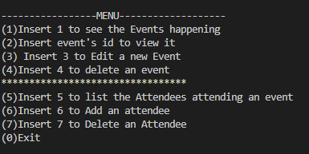
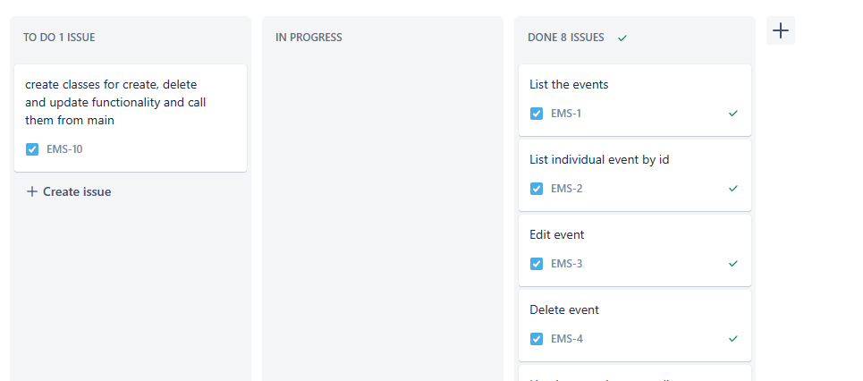

# Event Management System

## Introduction
This project has implemented all the CRUD operations along with file and exceptions handling.

## Features of this Project
The Event Management System is a console-based application which gives the user the full functionality on List, Create, Update and Delete data.

- List the events
- List individual event by Id
- Edit an event
- Delete an event
- List the attendees attending an event
- Add an attendee to an event
- Delete an attendee from an event

## 

## Environment

- Intellij Idea
- Java 17

### Making a Local Clone

1. Log in to the [GitHub Repository](https://github.com/kpashindla25/ems-KonstantinaStrantzali).
2. Click "Code" above the list of files, where you can Clone or Download the repository.
3. To clone using HTTPS click the clipboard symbol under "Clone with HTTPS".
4. Open Git Bash.
6. Current working directory needs to be changed to the new location, where you want the cloned directory to be.
7. Type `git clone`, and then paste the URL copied in Step 3.
8. Press Enter, to create the local clone.

## Technologies Used

Jira and Confluence was used throughout the building process of the application for tracking the progress and planning the next steps.

[Click here to see the project on Jira](https://konstrantz.atlassian.net/l/cp/1GuezeAy)

